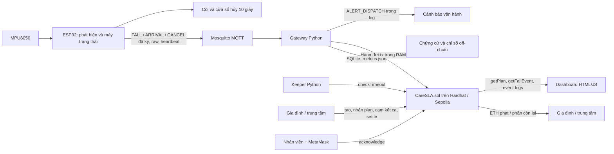
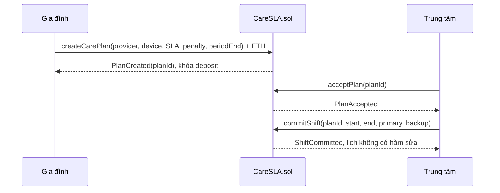
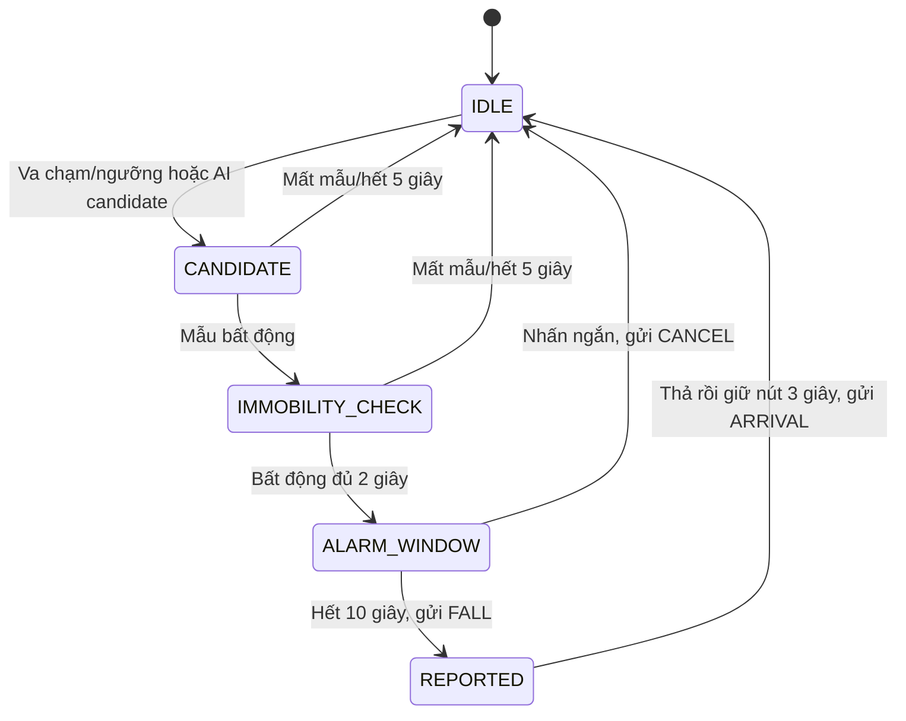

# Kiến trúc và luồng hoạt động CareSLA

> Khảo sát mã nguồn tại commit `773f08a` trên `main`, ngày 28/09/2026. Đây là tài liệu mô tả **hệ thống đang được cài đặt**, đối chiếu với [AGENTS.md](../AGENTS.md), [quyết định giao diện](interface_changes.md) và bằng chứng đã lưu trong repo. Cuộc khảo sát này đọc mã nguồn và tài liệu; không tự chạy lại build, test, ESP32 hoặc Sepolia.

## 1. Mục tiêu và ranh giới hệ thống

CareSLA giám sát té ngã của người cao tuổi và thực thi cam kết thời gian **xác nhận đã nhận cảnh báo** của trung tâm chăm sóc. Gia đình khóa ETH trong smart contract; trung tâm chấp nhận hợp đồng và cam kết ca trực trước khi ca bắt đầu. Khi có FALL hợp lệ, contract chụp lại nhân viên chính/dự phòng của ca, đặt hạn SLA, ghi vi phạm nếu quá hạn, rồi chia tiền cuối kỳ theo số vi phạm. Blockchain đóng vai trò giữ tiền và thực thi quy tắc, không chỉ lưu nhật ký.

Các vai trò: **gia đình** tạo plan và ký quỹ; **trung tâm** chấp nhận và cam kết ca; **nhân viên chính/dự phòng** ký giao dịch `acknowledge`; **ESP32** sở hữu khóa ký FALL/ARRIVAL; **gateway** chuyển sự kiện MQTT thành giao dịch; **keeper** chủ động gọi `checkTimeout`. Ai cũng có thể thay keeper gọi `checkTimeout` hoặc `settle`; hai hàm này không cấp quyền đặc biệt cho ví keeper.

### Hai luồng độc lập về thời gian xử lý



- **Cảnh báo:** còi trên ESP32 và dòng `ALERT_DISPATCH elapsed_ms=…` tại gateway. Mục tiêu dưới 2 giây trong [AGENTS.md](../AGENTS.md) là mục tiêu của nhánh cảnh báo sau khi sự kiện đã được gửi; firmware còn giai đoạn bất động 2 giây và hủy 10 giây trước FALL. Quyết định IC-17 đã bỏ Telegram khỏi demo; mã Telegram còn là tùy chọn khi cấu hình chat/token.
- **Trách nhiệm:** gateway gửi `reportFall`/`confirmArrival` tới contract; keeper, dashboard và ví người dùng tham gia xử lý SLA. Luồng này phụ thuộc RPC/blockchain, có thể tới chậm hơn cảnh báo.

## 2. Bản đồ thành phần

| Thành phần | Nguồn chính | Trách nhiệm và dữ liệu giữ |
| --- | --- | --- |
| AI và tài sản huấn luyện | [`ai_model/`](../ai_model/), [`docs/ai_input_spec.md`](ai_input_spec.md) | Notebook KFall, model INT8, thông số chuẩn hóa, golden vectors và mã nhúng model. |
| Firmware ESP32 | [`iot_code/main/`](../iot_code/main/), [`config.h`](../iot_code/main/config.h) | Đọc MPU6050, AI/ngưỡng, máy trạng thái, còi/nút, SNTP, nonce NVS, ký EIP-191, phát MQTT. |
| Broker | Mosquitto ngoài repo | Chuyển tiếp MQTT giữa thiết bị, gateway và monitor debug; không quyết định SLA. |
| Gateway | [`backend/gateway.py`](../backend/gateway.py) | Xác minh chữ ký ở đầu vào, log SQLite, ghi cảnh báo, so hash raw, xếp giao dịch vào queue trong RAM và thử lại khi RPC lỗi. |
| Keeper | [`backend/keeper.py`](../backend/keeper.py) | Quét event log và trạng thái mỗi 5 giây; gửi `checkTimeout` cho sự cố quá hạn. |
| Contract | [`CareSLA.sol`](../contracts/contracts/CareSLA.sol) | Nguồn sự thật on-chain về plan, ca, sự cố, nonce theo plan, vi phạm và ký quỹ ETH. |
| Dashboard giám sát | [`dashboard/index.html`](../dashboard/index.html), [`app.js`](../dashboard/app.js) | Đọc plan/sự cố và metrics; MetaMask ký `acknowledge` hoặc `settle`. |
| Trang thiết lập demo | [`dashboard/setup.html`](../dashboard/setup.html), [`setup.js`](../dashboard/setup.js) | Chỉ Hardhat local: tạo/nhận plan, cam kết ca, mô phỏng ca quá khứ, tua giờ và settle. |
| Công cụ demo/quan sát | [`tools/`](../tools/), [`visualizer/monitor.py`](../visualizer/monitor.py) | Thiết bị giả, vector chữ ký, E2E phần mềm, GUI sóng IMU/AI qua MQTT và USB serial. |

### Nơi dữ liệu tồn tại

| Nơi lưu | Nội dung | Tính bền |
| --- | --- | --- |
| Chain | Plan, địa chỉ thiết bị, ca trực, `dataHash`, sự cố, hạn, xác nhận, vi phạm, số ETH | Theo lịch sử chain; Hardhat local mất khi reset/restart node chưa lưu trạng thái. |
| NVS của ESP32 | Nonce chung cho FALL/ARRIVAL/CANCEL | Bền qua reboot; tăng và commit trước khi gửi. Khóa thiết bị hiện được cấu hình qua `secrets.h` khi build, **không** được mã nguồn ghi vào NVS. |
| RAM của ESP32 | Máy trạng thái, raw ring buffer, queue sự kiện/MQTT | Mất khi reset hoặc mất điện. |
| RAM gateway | `tx_queue`, `latest_event_id` theo thiết bị | Mất khi gateway restart; SQLite không được dùng để khôi phục hàng đợi giao dịch. |
| `gateway.db` SQLite | Event, raw base64, heartbeat, bảng alert tùy chọn | Bền trên máy chạy gateway; đường dẫn phụ thuộc thư mục làm việc hiện tại. |
| `dashboard/metrics.json` | Số CANCEL và heartbeat để UI hiển thị; trường latency Telegram cũ | File sinh định kỳ từ SQLite, bị Git ignore. |
| `deployments/<network>.json` và hai ABI | Địa chỉ, chainId, deployBlock; ABI thật từ artifact | Sinh bởi deploy script; phải tái sinh khi node local reset/deploy lại. |

## 3. Giao diện giữa thiết bị, gateway và contract

### MQTT và dữ liệu thô

`<deviceAddr>` là địa chỉ Ethereum viết thường dạng `0x...`:

| Topic | Payload chính | Xử lý |
| --- | --- | --- |
| `carensla/<deviceAddr>/event` | `device`, `eventType`, `timestamp`, `nonce`, `dataHash`, `sig` | `1=FALL`, `2=ARRIVAL`, `3=CANCEL`. Gateway lưu cả ba; chỉ FALL/ARRIVAL được xếp giao dịch on-chain. |
| `carensla/<deviceAddr>/raw` | `device`, `nonce`, `samples_b64` | Mỗi mẫu có 6 số `int16` little-endian theo `ax, ay, az, gx, gy, gz` (12 byte/mẫu). Snapshot tối đa 400 mẫu = 4.800 byte trước base64. |
| `carensla/<deviceAddr>/heartbeat` | `device`, `timestamp`, `battery:null` | ESP32 gửi mỗi 60 giây; gateway báo mất sau hơn 120 giây và báo khi phục hồi. Chỉ off-chain. |
| `carensla/<deviceAddr>/stream` | 10 mẫu và timestamp monotonic/mẫu | Kênh GUI debug khi `DEBUG_STREAM=1`, QoS 0; không thuộc giao diện nghiệp vụ đã chốt. |

Firmware gửi `event` rồi `raw` bằng QoS 1, đợi ACK từ broker. ACK chứng minh broker đã nhận, chưa chứng minh gateway đã ghi chain. Gateway kiểm tra `dataHash` so với raw dù `event` hay `raw` đến trước. Kết quả sai hash hiện được **in cảnh báo**, không tự chặn `reportFall`; contract chỉ nhận hash đã ký chứ không có raw để đối chiếu. CANCEL không có raw và dùng `dataHash` toàn byte 0.

### Chữ ký thiết bị

```text
packed      = address(20) || eventType uint8(1) || timestamp uint64 BE(8)
              || nonce uint64 BE(8) || dataHash bytes32(32)   = 69 byte
messageHash = keccak256(packed)
ethSigned   = keccak256("\x19Ethereum Signed Message:\n32" || messageHash)
sig         = secp256k1_sign(ethSigned) = r(32) || s(32) || v(1)
```

`v` là 27/28 và `s` phải low-s. `dataHash` của FALL/ARRIVAL là Keccak-256 của raw bytes trước base64. ESP32 dùng cùng một nonce tăng dần cho cả ba loại event và commit vào NVS trước ký/gửi; CANCEL cũng tiêu nonce nên `lastNonce(planId)` trên chain được phép nhảy số. Gateway phục hồi địa chỉ từ chữ ký trước khi ghi/đẩy giao dịch; contract kiểm tra lại địa chỉ thiết bị, `nonce > lastNonce(planId)` và timestamp trong khoảng `block.timestamp - 600` đến `block.timestamp + 60`. Bộ so khớp là [`docs/test_vectors.json`](test_vectors.json). Chữ ký hiện không gắn `chainId` hoặc địa chỉ contract, là giới hạn đã chốt.

## 4. Luồng nghiệp vụ đầu cuối

### 4.1 Thiết lập hợp đồng và ca trực



Plan ID và event ID bắt đầu từ 1. `createCarePlan` yêu cầu deposit > 0, SLA > 0, `penaltyWei <= deposit`, provider/device hợp lệ, provider khác gia đình và kỳ chưa kết thúc. Trung tâm phải chấp nhận trước khi cam kết ca. Ca phải bắt đầu **sau giờ block hiện tại**, nằm trong kỳ, không chồng ca khác, primary khác backup và tối đa 20 ca/plan. `getOnDuty` chọn ca chứa thời điểm thiết bị ghi FALL theo khoảng `[start,end)`; không có ca thì FALL bị từ chối.

Trang `setup.html` đi theo bốn bước trên ở chain 31337; mặc định hiện tại SLA 60 giây, ký quỹ 100 ETH, phạt 20 ETH, kỳ khoảng 15 phút. Script `demo_setup.js` là đường tạo plan khác: local 100/20 ETH, Sepolia 0,01/0,002 ETH; kỳ mặc định 2 giờ hoặc 5 phút với `--short-plan`. Các con số là cấu hình demo, không phải hằng số của contract.

### 4.2 Từ chuyển động đến FALL



MPU6050 được đọc 100 Hz, ±16 g và ±2.000°/s. Firmware duy trì ring raw tối đa 400 mẫu. Với `DETECTOR_MODE=1` hiện đang commit, ngưỡng gia tốc 1,5 g **arm** một phiên AI; model INT8 đưa ra candidate, rồi máy trạng thái kiểm tra bất động 2 giây. `DETECTOR_MODE=0` dùng ngưỡng gia tốc trực tiếp. Khi mở `ALARM_WINDOW`, còi kêu và snapshot FALL được giữ; nhấn ngắn hoặc lệnh debug USB `CANCEL_FALL` trong 10 giây gửi CANCEL chỉ off-chain. Hết cửa sổ, ESP32 gửi FALL đã ký và raw; sau đó giữ nút 3 giây gửi ARRIVAL đã ký và raw. Sự cố FALL đã lên chain vẫn phải được phản hồi, kể cả khi sau đó đánh giá là báo giả.

ESP32 chờ SNTP trước khi ký/gửi. Nếu đồng hồ đồng bộ sau khi phát hiện, firmware đổi thời điểm monotonic đã giữ sang Unix; nó không kéo timestamp cũ lên hiện tại để né cửa sổ 600 giây. Khi Wi-Fi/broker ngắt, queue của firmware và MQTT tiếp tục thử lại trong RAM. Mất điện có thể mất event chưa gửi; nonce NVS vẫn đã tiêu.

### 4.3 Gateway, ACK, chuyển cấp và ARRIVAL

```mermaid
sequenceDiagram
    participant D as ESP32
    participant M as Mosquitto
    participant G as Gateway
    participant C as CareSLA.sol
    participant K as Keeper
    participant U as Nhân viên/MetaMask
    D->>M: FALL đã ký + raw
    M->>G: MQTT event
    G-->>G: Xác minh sig; log ALERT_DISPATCH; lưu SQLite
    G->>C: queue -> reportFall(planId, ts, nonce, hash, sig)
    C-->>G: FallReported(eventId, deadline)
    alt xác nhận đúng hạn
        U->>C: acknowledge(eventId)
        C-->>U: Acknowledged
    else quá hạn, vẫn Open
        K->>C: checkTimeout(eventId)
        C-->>K: Escalated + SlaViolation
    end
    D->>M: ARRIVAL đã ký + raw
    M->>G: MQTT event
    G->>C: confirmArrival(eventId, ts, nonce, hash, sig)
    C-->>G: Arrived
```

Gateway nhận MQTT, xác minh chữ ký low-s, lưu SQLite, rồi `handle_fall` **in ngay** `ALERT_DISPATCH` trước thao tác RPC. Sau đó một worker FIFO gửi giao dịch; RPC lỗi sẽ thử lại mỗi 2 giây, contract revert thì bỏ task. `reportFall` yêu cầu plan đã nhận, chưa settle, FALL không sau kỳ, timestamp hợp lệ, nonce mới, chữ ký đúng device và có ca trực. `reportedAt` là **giờ block giao dịch**; `deadline = reportedAt + slaSeconds`. Vì thế SLA đo từ lúc FALL lên chain, không tính từ lúc cảm biến bắt đầu phát hiện hoặc từ timestamp thiết bị.

Contract chụp `primary`/`backup` tại FALL. `acknowledge` chỉ cho hai ví đó, dù sự cố ở level 0, 1 hay 2. SLA đo tới ACK; `arrivedAt` được lưu làm bằng chứng có mặt nhưng không dùng để tính SLA. ARRIVAL có thể đến trước ACK; cần chữ ký thiết bị eventType 2, timestamp không trước FALL và nonce mới. Gateway ghép ARRIVAL với `eventId` FALL mới nhất theo device từ **RAM của tiến trình** sau receipt `FallReported`.

Keeper đọc log từ `deployBlock`, dựng lại hạn/trạng thái, kiểm tra cùng block và mỗi 5 giây gọi `checkTimeout` nếu `Open`, level < 2, `block.timestamp > deadline`. Nó giữ giao dịch đang chờ để tránh cấp nonce giao dịch mới khi kết quả cũ chưa rõ. Nếu có reorg/reset trong vùng đã quét, nó quét lại từ deployment. `checkTimeout` cấp 0→1 ghi một vi phạm và hạn mới cho backup; cấp 1→2 ghi vi phạm thứ hai, báo địa chỉ gia đình, deadline về 0. Sau cấp 2 không còn timeout nào nữa. Nếu ACK/ARRIVAL đến khi Open đã quá hạn mà keeper chưa gọi, contract tự ghi **một cấp vi phạm đang quá hạn** trước khi đóng sự cố. Vi phạm đã ghi không bị xóa.

`pendingEvents` chỉ đếm sự cố còn `Open` và level < 2. Nó tăng ở `reportFall`, giảm khi ACK/ARRIVAL lúc còn Open hoặc khi lên level 2. Vì vậy một sự cố level 2 vẫn có thể `Open` nhưng không còn chặn `settle`; đây là chủ ý IC-12.

### 4.4 Chia tiền cuối kỳ

`settle(planId)` chỉ chạy một lần, khi `block.timestamp > periodEnd + 600` và `pendingEvents == 0`. Nếu trung tâm chưa chấp nhận, gia đình được hoàn toàn bộ. Nếu đã nhận:

```text
tiền phạt hoàn gia đình = min(violations × penaltyWei, deposit)
tiền trung tâm nhận      = deposit − tiền phạt hoàn gia đình
```

Contract đánh dấu `settled` trước khi chuyển ETH bằng `call` và dùng `ReentrancyGuard`. Với plan local 100/20 ETH và hai vi phạm: gia đình nhận 40 ETH, trung tâm 60 ETH (chưa tính gas ví gửi giao dịch). `settle` kiểu đẩy có thể revert nếu một địa chỉ nhận là contract từ chối ETH; đây là giới hạn IC-13.

## 5. AI: đường huấn luyện và đường chạy trên thiết bị

Notebook [`Model_AI_nhom3.ipynb`](../ai_model/Model_AI_nhom3.ipynb) là tài sản huấn luyện từ KFall. Model bàn giao [`dilated_aug_s0_int8.tflite`](../ai_model/dilated_aug_s0_int8.tflite) có đầu vào `int8 [1,50,6]`: 50 mẫu × 6 kênh trong 0,5 giây, suy luận mỗi 10 mẫu. Firmware chuyển raw MPU6050 sang g và °/s, chuẩn hóa theo mean/std của P4, chặn [-4,4], lượng tử INT8, rồi chạy TFLite Micro. Hai cửa sổ liên tiếp phải đạt `p_fall >= 0,7` mới tạo candidate. Runtime đăng ký 12 toán tử và dành tensor arena 96 KiB; CMake áp patch TFLite Micro cho `SPACE_TO_BATCH_ND`.

Chỉ số TP 445, FN 0, FP 23, TN 503 được ghi cho **tập test KFall** tại ngưỡng trên; không suy ra độ chính xác trên người cao tuổi hoặc ESP32. `AI_RUN_GOLDEN_TESTS=0` trong cấu hình hiện tại; golden INT8 trên board từng không khớp và chiều lắp/hệ trục MPU6050 so với KFall chưa được đo xác nhận. Ngoài ra model được mô tả là candidate trước va chạm, trong khi firmware hiện chỉ arm AI sau khi ngưỡng va chạm 1,5 g xuất hiện; tính phù hợp của cách nối này cần kiểm chứng thực nghiệm. Build AI được ghi nhận đạt trong [`docs/progress/P6.md`](progress/P6.md), nhưng chưa có bằng chứng chắc chắn rằng image mode 1 đã flash/chạy đúng và dự đoán đúng trên board.

[`visualizer/monitor.py`](../visualizer/monitor.py) là công cụ debug riêng: đọc `/stream`, `/raw`, `/event`, heartbeat từ MQTT để vẽ sóng và đọc `AI_LIVE` qua USB serial; có thể gửi lệnh hủy trong cửa sổ qua serial. Nó không tham gia ra quyết định on-chain.

## 6. Triển khai và phụ thuộc vận hành

| Môi trường | Thiết lập chính |
| --- | --- |
| Hardhat local | ChainId 31337, RPC `127.0.0.1:8545`; node tạo block định kỳ 1 giây; deploy lại sau reset node. `setup.html` và lệnh tua giờ chỉ dùng ở đây. |
| Sepolia | ChainId 11155111, RPC từ `SEPOLIA_RPC_URL`, cần ví testnet và Etherscan API key để verify. Repo hiện chỉ có `deployments/localhost.json`, chưa có bằng chứng deploy/verify Sepolia. |
| Contract toolchain | Solidity 0.8.24, optimizer 200, `viaIR=true`, Cancun; Hardhat 2, ethers v6, OpenZeppelin 5. Deploy script xuất ABI sang backend/dashboard. |
| Backend | Python 3.10+, web3 v7, paho-mqtt v2 (`CallbackAPIVersion.VERSION2`), SQLite, Mosquitto trên laptop demo. |
| Firmware | ESP-IDF v5.x, `espressif/esp-tflite-micro`, trezor crypto; submodule TFLite Micro cần `git submodule update --init --recursive`. |
| Web | HTML/JS thuần, ethers UMD 6.13.4 từ CDN, MetaMask; serve từ **gốc repo** bằng `python -m http.server 8000` để `/deployments/` tải được. |

Thứ tự demo local: khởi động Hardhat node → deploy contract (xuất ABI/deployment) → tạo plan bằng `setup.html` **hoặc** `demo_setup.js` → điền đúng `PLAN_ID`, device, ví gateway/keeper và broker → khởi động Mosquitto, gateway, keeper → serve dashboard → gửi sự kiện bằng ESP32 hoặc [`fake_device.py`](../tools/fake_device.py). `fake_device.py` dùng khóa test riêng và nonce SQLite commit trước publish. Nếu dùng `setup.html` để plan đầu tiên là #1, không chạy `demo_setup.js` trước. Xem [runbook](demo_runbook.md) và kiểm tra lại các mục ghi trạng thái cũ trước buổi demo.

Dashboard giám sát poll chain mỗi 2 giây; trên local đọc thẳng RPC để tránh cache `eth_call` của MetaMask, MetaMask chỉ ký giao dịch. Trên Sepolia nó đọc qua MetaMask. UI lọc sự cố theo planId query string nhưng `eventCount()` là toàn contract rồi gọi `getFallEvent` cho từng ID; chi phí đọc tăng theo tổng số sự cố. `setup.html` chỉ chấp nhận chain 31337 và đọc event PlanCreated/Accepted/ShiftCommitted từ deployment để hiển thị bằng chứng từng bước.

## 7. Bằng chứng hiện có và giới hạn cần hiểu đúng

| Nội dung | Bằng chứng trong repo | Kết luận hợp lệ |
| --- | --- | --- |
| Contract/keeper | [`docs/progress/P6.md`](progress/P6.md), báo cáo P2 | Có báo cáo 66 test JS và 20 unit keeper đã đạt ở phiên trước; khảo sát này chưa chạy lại. |
| E2E phần mềm | [`P6_local_results.json`](report/P6_local_results.json), [`check_local_e2e.py`](../tools/check_local_e2e.py) | Ba vòng với thiết bị giả, broker/node riêng: CANCEL off-chain, RPC lỗi rồi retry, hai cấp timeout, ARRIVAL, settle. Log `ALERT_DISPATCH` từ khi gateway nhận MQTT là 20,2/55,7/47,5 ms; không phải độ trễ từ cảm biến tới người chăm sóc. |
| Demo trang thiết lập | [`P6_dashboard_demo_results.json`](report/P6_dashboard_demo_results.json) | Tổng dượt phần mềm khoảng 169 giây, có RPC/MQTT/gateway/keeper thật trong fixture nhưng DOM/ví mô phỏng; chưa thay cho MetaMask thủ công. Fixture dùng 1/0,2 ETH, khác mặc định UI hiện tại 100/20. |
| Phần cứng/AI | [`docs/progress/P3.md`](progress/P3.md), [`docs/progress/P6.md`](progress/P6.md) | Có ghi nhận board gửi heartbeat/CANCEL/FALL lên chain local; ARRIVAL bằng nút thật, image AI mode 1, golden, latency đầu cuối và đo tài nguyên chưa có xác nhận đầy đủ. |
| Sepolia | `deployments/` chỉ có localhost | Chưa thể khẳng định hệ thống đã triển khai hoặc verify trên Sepolia. |

### Các điểm dễ gây sai lệch khi đọc repo

1. [README](../README.md), [runbook](demo_runbook.md), [tổng quan cũ](study/tong_quan_he_thong.md) và một số README tầng còn nhắc Telegram hoặc mặc định mode/ngân sách cũ. Với kiến trúc hiện tại, ưu tiên [AGENTS.md](../AGENTS.md), IC-17/18, [`config.h`](../iot_code/main/config.h) và source; Telegram còn trong gateway nhưng demo không cấu hình.
2. Gateway giữ FIFO và thử lại khi RPC lỗi **trong cùng tiến trình**. SQLite lưu log, không lưu task để khôi phục; restart khi đang chờ có thể mất FALL/ARRIVAL chưa lên chain. `latest_event_id` cũng mất, nên ARRIVAL sau restart có thể không tìm được sự cố để gọi `confirmArrival`.
3. Thiết bị lưu nonce bền, nhưng event queue và trạng thái FALL không bền. MQTT QoS1 và ACK broker không bảo đảm xử lý on-chain đúng một lần; chống replay on-chain dựa vào `lastNonce(planId)`.
4. `REGISTERED_DEVICES` là bộ lọc gateway nếu được cấu hình; contract vẫn tự đối chiếu chữ ký với `device` của plan. Gateway dùng một `PLAN_ID` từ môi trường cho luồng demo. Trường `device` trong topic không được dùng làm chứng cứ quyền hạn; chữ ký là căn cứ xác thực.
5. Log/metrics chỉ là dữ liệu off-chain. Số `false_alarm_count` trên dashboard thực chất đếm CANCEL, không phải phép đo tỷ lệ báo giả của mô hình. `ALERT_DISPATCH` là log tại laptop; dự án hiện không có cơ chế giao cảnh báo trực tiếp tới điện thoại nhân viên trong phạm vi IC-17.
6. Trên chain không có raw IMU hoặc dữ liệu sức khỏe dạng mẫu; chỉ hash và metadata cần cho SLA. Khóa thiết bị được biên dịch từ `secrets.h` cục bộ; cần bảo vệ file/firmware và không dùng khóa vector test ngoài kiểm thử.

## 8. Điểm tra cứu nhanh trong source

- Luật tiền, quyền và thời gian: [`contracts/contracts/CareSLA.sol`](../contracts/contracts/CareSLA.sol).
- Phát hiện, cửa sổ hủy, gửi event: [`iot_code/main/main.c`](../iot_code/main/main.c), [`state.c`](../iot_code/main/state.c), [`net.c`](../iot_code/main/net.c), [`signer.c`](../iot_code/main/signer.c).
- AI runtime và đặc tả: [`detector.cc`](../iot_code/main/detector.cc), [`ai_input_spec.md`](ai_input_spec.md).
- MQTT → SQLite/chain: [`backend/gateway.py`](../backend/gateway.py); timeout: [`backend/keeper.py`](../backend/keeper.py).
- Triển khai và UI: [`contracts/scripts/deploy.js`](../contracts/scripts/deploy.js), [`demo_setup.js`](../contracts/scripts/demo_setup.js), [`dashboard/app.js`](../dashboard/app.js), [`dashboard/setup.js`](../dashboard/setup.js).
