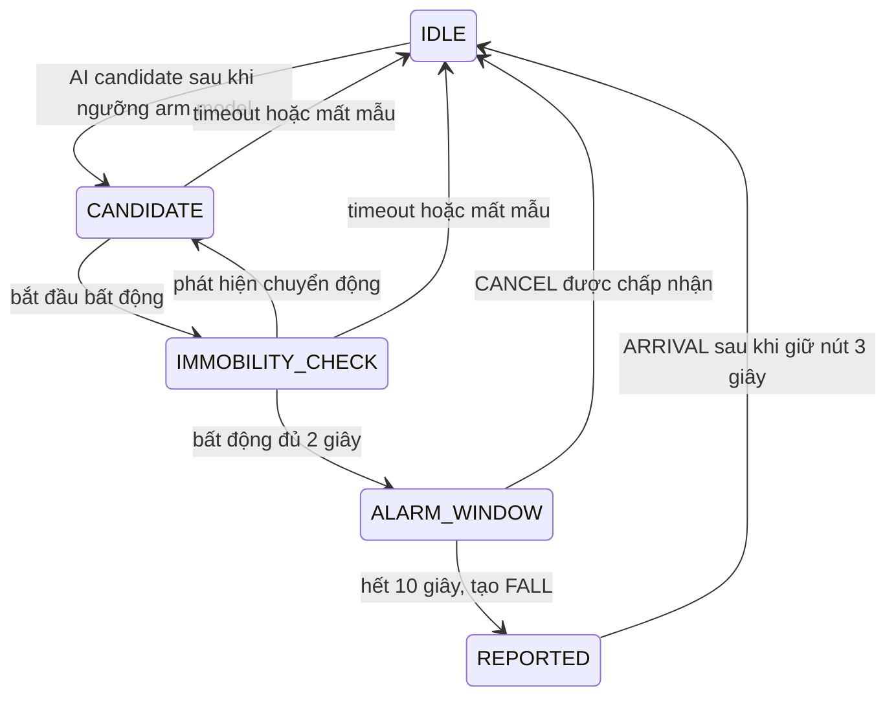

# Báo cáo P3 — Thiết bị IoT

## Trạng thái báo cáo
Phiên bản này mô tả mã nguồn P3 tại ngày 2026-09-27. Firmware ESP-IDF build được, nhưng binary mới chưa được flash và kiểm tra end-to-end trên board. Các kết quả AI trên ESP32, độ trễ thực tế và thao tác hủy qua USB vì vậy chưa được xác nhận bằng thử nghiệm phần cứng.

## Phần cứng và cấu hình
Thiết kế dùng ESP32 DevKit V1 và MPU6050 qua I2C. Theo `iot_code/main/config.h`, GPIO đang cấu hình SDA=25, SCL=26, nút=5, buzzer=18; cần đối chiếu các chân này với dây thật trước khi cấp nguồn. Thiết bị dự kiến gắn cứng ở thắt lưng, nhưng ảnh/sơ đồ lắp đặt và phép xác nhận chiều trục với cách đeo KFall chưa có trong hồ sơ.

Firmware dùng ESP-IDF 5.5.5, lấy mẫu danh nghĩa 100 Hz, dải gia tốc ±16g (2048 LSB/g), gyro ±2000°/s (16.4 LSB/(°/s)); ring buffer chứa tối đa 400 mẫu. Các giá trị đúng với scale yêu cầu trong đặc tả P4, nhưng cấu hình đúng không tự chứng minh cảm biến đã được gá đúng chiều hoặc không có lệch gyro.

## AI và phát hiện té ngã
Model `dilated_aug_s0_int8.tflite` có kích thước 51.120 byte, input INT8 `[1, 50, 6]` theo thứ tự AccX, AccY, AccZ, GyrX, GyrY, GyrZ; 50 mẫu tương ứng 0,5 giây ở 100 Hz. Firmware chuẩn hóa theo mean/std trong đặc tả P4, giới hạn z-score trong [-4, 4], rồi lượng tử hóa về INT8. Mô hình chạy lại sau mỗi 10 mẫu mới.

Output `[1, 2]` là logits: index 0 là ADL, index 1 là FALL. Firmware tính xác suất từ hiệu logits, dùng ngưỡng tương đương p(FALL) ≥ 0,7 và yêu cầu hai cửa sổ liên tiếp để tạo candidate. Ngưỡng gia tốc 1,5g trên ESP32 chỉ arm suy luận; nó không tự kết luận té ngã.

Candidate tiếp tục qua state machine: cần bất động khoảng 2 giây (norm gia tốc trong ±0,15g quanh 1g và gyro không quá 15°/s), rồi buzzer và cửa sổ hủy 10 giây. Đây là các tham số cấu hình hiện tại, chưa phải số đo độ nhạy/độ đặc hiệu ngoài thực địa.

**Tình trạng xác thực AI:** `AI_RUN_GOLDEN_TESTS=0`. Golden INT8 trên board từng mismatch; do đó không kết luận model cho dự đoán đúng trên ESP32 chỉ từ việc Allocate/Invoke hoặc log candidate. Cần giải quyết golden theo P4 hoặc áp dụng phương án dự phòng đã thống nhất, đồng thời ghi rõ giới hạn.

## Máy trạng thái và hủy

Theo IC-15 đã được nhóm chốt, khi monitor nhận marker `FALL_WINDOW_OPEN`, nút GUI gửi `CANCEL_FALL\n` qua USB serial. Firmware đọc serial ở task riêng; lệnh chỉ được state machine chấp nhận trong `ALARM_WINDOW`, tương đương nhấn ngắn. Monitor không tự xóa banner khi gửi lệnh mà chờ event MQTT CANCEL. Nút vật lý vẫn được firmware hỗ trợ, nhưng P3 hiện chưa có nút vật lý; monitor chưa có lệnh ARRIVAL. `DEVICE_READY` chỉ đồng bộ lại giao diện sau reset, không phát CANCEL/ARRIVAL và không thay đổi trạng thái contract.

## Sự kiện, chữ ký và MQTT
Các event đi trên `carensla/<deviceAddr>/event`; `eventType` 1=FALL, 2=ARRIVAL, 3=CANCEL. Payload gồm `device`, `eventType`, `timestamp`, `nonce`, `dataHash`, `sig`. Firmware đóng gói 69 byte theo `abi.encodePacked`, dùng uint64 big-endian, Keccak-256 và EIP-191; chữ ký secp256k1 có recovery id `v=27/28`.

Raw của FALL/ARRIVAL đi trên `carensla/<deviceAddr>/raw`, chứa base64 của sáu giá trị int16 little-endian mỗi mẫu theo thứ tự ba trục gia tốc rồi ba trục gyro. Hash được tính trên đúng bytes raw. CANCEL dùng `dataHash=0` và không gửi raw. Heartbeat đi trên `carensla/<deviceAddr>/heartbeat` mỗi 60 giây, chỉ giám sát off-chain.

Nonce tăng chung cho event và được commit vào NVS trước khi ký/gửi. Worker sự kiện gửi FIFO, dùng MQTT QoS 1 và chờ broker ACK; ACK broker không đồng nghĩa Gateway hoặc contract đã xử lý. Event queue và state hiện ở RAM nên có thể mất khi mất điện/reset; nonce vẫn được lưu trong NVS. Firmware chờ SNTP trước khi gửi timestamp Unix.

## Kiểm chứng
- `ninja -C iot_code/build -j2`: build ESP-IDF 5.5.5 thành công; binary gần nhất `0xf8630` byte, app partition còn khoảng 3%.
- `python -m py_compile visualizer/monitor.py`: thành công.
- GCC build/run `iot_code/tests/state_test.c`: PASS cho ranh giới CANCEL/FALL, retry queue, ARRIVAL và mất mẫu cảm biến.
- Smoke test Python kiểm tra trạng thái monitor, parser serial và hàng đợi lệnh hủy: PASS. Đây là test host/mock, không thay cho thử COM/ESP32 thật.
- Ảnh monitor người dùng cung cấp trước đó cho thấy đã nhận một event FALL qua MQTT. Ảnh này không chứng minh binary mới có nút hủy serial đã chạy trên board.

Chưa có số liệu được đo trên board cho thời gian inference, arena/heap/stack, độ chính xác, jitter lấy mẫu hoặc độ trễ cảnh báo 20 lần. Không báo cáo các con số này như kết quả thực nghiệm.

## Giới hạn và công việc tiếp theo
Khóa thiết bị nằm trong firmware/flash; chưa có flash encryption hoặc secure element. Thao tác giữ nút không chứng minh danh tính người bấm. Heartbeat chỉ cho biết thiết bị còn liên lạc, không chứng minh cảm biến đo đúng. State/event queue không bền qua reset; nonce có bền. Theo giới hạn chung, chữ ký không gắn với địa chỉ contract hoặc chainId.

1. Flash binary mới; chạy monitor với `--serial COMx` và thử `DEVICE_READY`, nút hủy trong cửa sổ 10 giây, CANCEL, không hủy để phát FALL, và ARRIVAL.
2. Xử lý golden mismatch/đánh giá phương án dự phòng, sau đó đo runtime và 20 lần độ trễ với quy trình an toàn, luôn có người giám sát và chỉ thử té trên nệm.
3. Chạy end-to-end với Gateway/Hardhat; kiểm tra MQTT subscriber cùng broker và receipt phía chain trước khi kết luận toàn luồng đạt.
