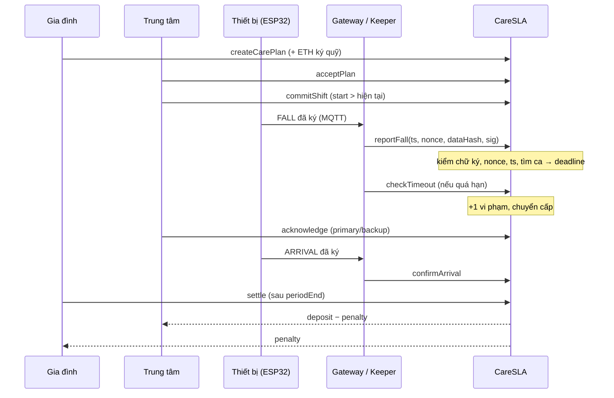
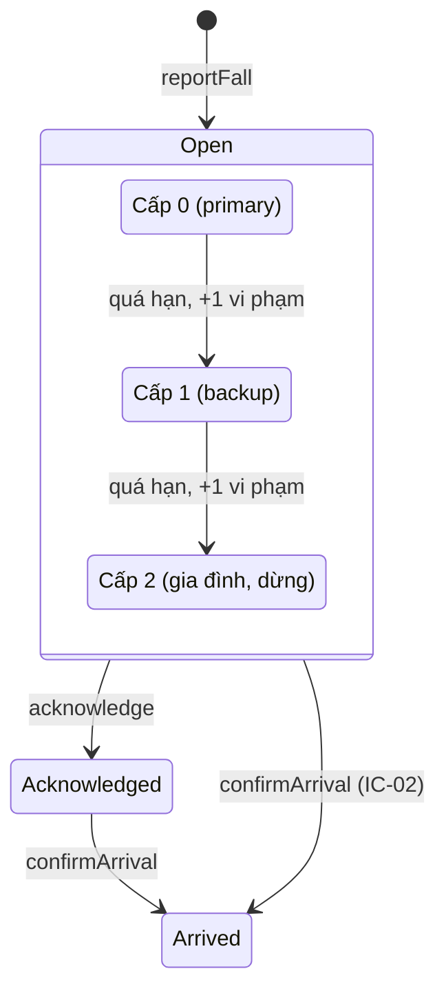

# Ôn phản biện — P1 (Trưởng nhóm & Smart Contract)

> Bản dựa trên `contracts/contracts/CareSLA.sol`. IC-01 → IC-15 trong `docs/interface_changes.md` đã **ĐÃ CHỐT** (2026-09-27) và đã đưa vào AGENTS.md.

## 1. Tôi đã làm gì

Tôi viết smart contract `CareSLA.sol`, đóng vai "trọng tài" giữa gia đình và trung tâm chăm sóc. Gia đình nộp tiền ký quỹ vào contract, trung tâm chấp nhận hợp đồng và phải cam kết lịch trực **trước** khi ca bắt đầu. Khi người già té ngã, thiết bị ký gói tin bằng khóa riêng, gateway gửi lên, và contract tự kiểm chữ ký rồi đặt hạn phản hồi. Quá hạn thì contract ghi vi phạm và chuyển cho người dự phòng, rồi tới gia đình. Cuối kỳ, contract tự chia tiền: gia đình nhận lại tiền phạt, trung tâm nhận phần còn lại. Không bên nào sửa được luật hay rút tiền ngoài luật.

## 2. Luồng xử lý phần của tôi



Trạng thái sự cố và cấp chuyển:



## 3. Các đoạn code quan trọng nhất

### 3.1 Kiểm chữ ký thiết bị (`_verifyDevice`)
```solidity
require(nonce > lastNonce[planId], "old nonce");                         // chống gửi lại gói cũ (nonce theo plan)
bytes32 messageHash = hashEvent(device, eventType, ts, nonce, dataHash); // tự tính lại hash
bytes32 ethSigned = MessageHashUtils.toEthSignedMessageHash(messageHash); // tiền tố EIP-191
address signer = ECDSA.recover(ethSigned, sig);                          // tính ngược ra người ký
require(signer == device, "bad sig");
lastNonce[planId] = nonce;
```
- Contract **tự tính lại** hash từ dữ liệu gateway gửi lên. Gateway sửa 1 bit thì hash đổi, và `recover` ra địa chỉ khác.
- Nonce tính **theo plan**, không theo thiết bị (IC-11). Nếu tính theo thiết bị, kẻ gian tạo một hợp đồng bù nhìn dùng chung địa chỉ thiết bị, nộp chữ ký FALL vào đó trước là tiêu mất nonce, hợp đồng thật bị từ chối và mất vi phạm. Tính theo plan thì hợp đồng bù nhìn chỉ nhận được một bản sao vô hại.
- `hashEvent` băm 69 byte: `device(20) | eventType(1) | ts(8) | nonce(8) | dataHash(32)`, số nguyên theo big-endian.

### 3.2 Cam kết ca trực trước (`commitShift`)
```solidity
require(start > block.timestamp, "start in past");  // không ghi lịch cho quá khứ
require(list.length < MAX_SHIFTS, "too many shifts"); // tối đa 20 ca
for (uint256 i = 0; i < list.length; i++) {
    require(end <= list[i].start || start >= list[i].end, "overlap");
}
list.push(Shift(start, end, primary, backup));        // chỉ có thêm, không có sửa/xóa
```

### 3.3 Chuyển cấp khi quá hạn (`_escalate`)
```solidity
p.violations += 1;
if (e.level == 0) {
    e.level = 1;                                           // chuyển cho backup
    e.deadline = uint64(block.timestamp) + p.slaSeconds;   // hạn mới
    emit Escalated(eventId, 1, e.backup, e.deadline);
} else {
    e.level = 2;                                           // báo gia đình, dừng
    e.deadline = 0;
    emit Escalated(eventId, 2, p.family, 0);
}
```
- `level` tăng ngay trong cùng giao dịch, nên gọi `checkTimeout` lặp lại cũng không phạt 2 lần ở một cấp.
- Không có dòng nào giảm `violations`, nên vi phạm đã ghi không bao giờ bị xóa.

### 3.4 Chia tiền (`settle`): Checks → Effects → Interactions
```solidity
require(block.timestamp > p.periodEnd + SETTLE_DELAY, "period not ended"); // Checks
require(!p.settled, "already settled");
require(p.pendingEvents == 0, "pending events");            // mọi vi phạm đã ghi xong
p.settled = true;                                            // Effects: ghi TRƯỚC
uint256 penalty = p.violations * p.penaltyWei;
if (penalty > p.deposit) penalty = p.deposit;               // min(vi phạm × phạt, ký quỹ)
(bool ok, ) = payable(p.provider).call{value: p.deposit - penalty}(""); // Interactions: SAU
```
Hàm còn có modifier `nonReentrant` của OpenZeppelin làm lớp chặn thứ hai.

`pendingEvents` đếm số sự cố còn có thể bị phạt (đang `Open` và chưa lên cấp 2). Nếu thiếu điều kiện này, trung tâm có thể gọi `settle` ngay khi hết kỳ, trước khi sự cố cuối kỳ kịp quá hạn, để né phạt (IC-12). `SETTLE_DELAY` = 600 giây cho sự cố còn trong hàng đợi của gateway kịp lên chain.

## 4. Quyết định thiết kế và lý do

| Quyết định | Lý do | Phương án đã cân nhắc nhưng bỏ |
|---|---|---|
| Contract giữ ETH ký quỹ, tự chia tiền | Blockchain phải làm trọng tài, không chỉ lưu log (yêu cầu của giảng viên) | Chỉ ghi log lên chain, thanh toán ngoài đời: bị chê là "chỉ lưu log" |
| Chỉ tin chữ ký thiết bị, không tin người gọi | Gateway có thể bị trung tâm kiểm soát | Chỉ cho gateway gọi (`onlyGateway`): gateway gian lận thì hết cách |
| Lịch trực cam kết trước, không sửa được | Chặn trung tâm đổi tên người trực sau sự cố | Cho sửa lịch kèm lý do: vẫn né trách nhiệm được |
| Keeper Python gọi `checkTimeout`, ai cũng gọi được | Contract không tự chạy; đơn giản, miễn phí | Chainlink Automation: tốn thời gian tích hợp, đã cắt khỏi phạm vi |
| Nonce tăng nghiêm ngặt, lưu on-chain | Chặn gửi lại gói cũ | Lưu danh sách hash đã dùng: tốn gas hơn |
| Cửa sổ `ts` [−600 s, +60 s] | Đồng hồ ESP32 và chain lệch nhau; chặn gửi gói cũ sau vài ngày | Bắt `ts` khớp chính xác: không khả thi |
| Tối đa 20 ca / hợp đồng, cấm ca chồng giờ | Vòng lặp có giới hạn (gas); mỗi thời điểm chỉ có một người trực chính | Mapping theo giờ: phức tạp hơn nhiều |
| Nonce theo plan, không theo thiết bị (IC-11) | Chặn hợp đồng bù nhìn dùng chung thiết bị cướp nonce | Thêm `planId` vào nội dung ký: phải sửa ESP32, gateway, test vector |
| `settle` chờ `pendingEvents == 0` và `periodEnd + 600 s` (IC-12) | Chặn settle sớm để né phạt; sự cố trong hàng đợi kịp lên chain | Chỉ thêm thời gian chờ: keeper chết thì vẫn lọt |
| Bấm nhận trễ thì tự ghi phạt trước (IC-08) | Vá lỗ hổng "nhận ngay sau hạn trước khi keeper gọi" | Giữ đúng chữ spec: bỏ lọt vi phạm |
| Không có `markFalseAlarm` on-chain | Đã lên chain thì nhân viên vẫn phải kiểm tra; báo giả lọc bằng cửa sổ hủy 10 giây trên thiết bị | Cho trung tâm đánh dấu báo giả: sẽ lạm dụng để xóa sự cố thật |
| ETH gốc thay vì token | Đơn giản, không cần ERC-20 | Stablecoin (USDC): phù hợp khi triển khai thật |

## 5. Câu hỏi giảng viên có thể hỏi và gợi ý trả lời

**Q1. `ECDSA.recover` / `ecrecover` hoạt động thế nào? Vì sao không cần lưu khóa công khai?**
Chữ ký ECDSA trên đường cong secp256k1 gồm `r, s, v`. Có hash và chữ ký thì toán học cho phép tính ngược ra khóa công khai của người ký, rồi suy ra địa chỉ (20 byte cuối của keccak256 khóa công khai). Contract chỉ cần lưu địa chỉ thiết bị và so với địa chỉ tính ra. `v` (27/28) cho biết chọn nghiệm nào trong 2 nghiệm có thể.

**Q2. Gateway có tự tạo được sự kiện FALL giả không?**
Không. Gateway không có khóa riêng của thiết bị, nên chữ ký nó tạo ra sẽ khôi phục ra địa chỉ khác và bị chặn với `"bad sig"`. Gateway cũng không sửa được `ts` hay `dataHash`, vì hash đổi thì chữ ký không còn khớp. Gateway chỉ có thể **không gửi** (xem mục 6).

**Q3. Vì sao lịch ca phải cam kết trước? Nếu trung tâm không chịu cam kết ca thì sao?**
Nếu được ghi sau, trung tâm sẽ ghi tên người có lợi cho mình sau khi sự cố đã xảy ra. `start > block.timestamp` khiến việc này bất khả thi. Nếu trung tâm không cam kết ca, `reportFall` báo `"no shift"`. Sự cố không lên chain được, nhưng dashboard cho gia đình thấy rõ ca trống: đó là bằng chứng trung tâm không thực hiện cam kết. Đây là giới hạn đã biết (mục 6).

**Q4. Reentrancy là gì, `settle` chống nó thế nào?**
Khi contract gửi ETH, nếu người nhận là một contract độc hại, nó có thể gọi ngược lại `settle` trong lúc đang nhận tiền để rút lần hai (vụ The DAO năm 2016). `settle` có 2 lớp chặn: đặt `settled = true` **trước** khi chuyển tiền (checks-effects-interactions), và modifier `nonReentrant` khóa hàm trong lúc đang chạy.

**Q5. Vì sao dùng ETH thay vì token? Khi triển khai thật nên dùng gì?**
Trong đồ án, ETH gốc giúp code đơn giản: không cần `approve`/`transferFrom`, ít lỗi hơn. Khi triển khai thật nên dùng stablecoin (ví dụ USDC), vì giá ETH biến động mạnh, làm giá trị tiền ký quỹ và tiền phạt không ổn định.

**Q6. Gas của từng hàm là bao nhiêu?**
⚠️ **Chưa đo.** Lấy số đo thật từ P2 (hardhat-gas-reporter) ở Giai đoạn 3 và điền vào đây. Có thể giải thích định tính: `reportFall` đắt nhất vì ghi nhiều ô storage mới; `commitShift` tăng theo số ca đã có (vòng lặp kiểm tra chồng giờ); hàm đọc miễn phí.

**Q7. Keeper ngừng chạy thì sao?**
`checkTimeout` là hàm công khai, ai cũng gọi được, kể cả gia đình qua dashboard. Nếu nhân viên bấm nhận trễ trong lúc keeper chết, `acknowledge` vẫn tự ghi vi phạm trước (IC-08). Ngoài ra, `settle` không chạy được khi còn sự cố treo (`pendingEvents > 0`), nên mọi vi phạm bắt buộc phải được ghi trước khi chia tiền. Keeper chết thì chỉ làm chậm việc chia tiền, không làm mất vi phạm.

**Q8. Báo động giả đã lên chain có bị phạt không? Vì sao như vậy là hợp lý?**
Có, nếu nhân viên không phản hồi đúng hạn. Ngoài đời, khi có báo động nhân viên vẫn phải đến kiểm tra, vì không ai biết trước đó là giả. Báo giả được lọc **trước** khi lên chain bằng cửa sổ hủy 10 giây trên thiết bị. Nếu cho trung tâm "đánh dấu báo giả" on-chain, họ sẽ lạm dụng để xóa cả sự cố thật.

**Q9. Giới hạn "chữ ký không gắn với contract/chainId" nghĩa là gì?**
Nội dung được ký chỉ gồm `device, eventType, ts, nonce, dataHash`, không có địa chỉ contract hay chainId. Về lý thuyết, một chữ ký hợp lệ ở contract A (hoặc trên Hardhat) có thể đem nộp lại ở contract B (hoặc trên Sepolia) nếu cùng thiết bị và nonce ở B còn thấp hơn. Cách sửa chuẩn là dùng EIP-712 (gắn tên miền, chainId, địa chỉ contract). Nhóm chấp nhận giới hạn này để giữ cách ký đơn giản trên ESP32 và ghi rõ trong báo cáo.

**Q10. Tại sao không dùng MySQL?**
Bên giữ database là trung tâm, cũng chính là bên bị phạt, nên có xung đột lợi ích. Contract giữ tiền và tự thực thi luật, không bên nào sửa được.

**Q11. Blockchain chậm hoặc lỗi thì người già có bị nguy hiểm không?**
Không. Cảnh báo đi luồng riêng qua MQTT và Telegram (dưới 2 giây). Blockchain chỉ ghi trách nhiệm; gateway giữ hàng đợi và gửi lên chain sau (trong cửa sổ 10 phút).

**Q12. Dữ liệu sức khỏe có bị công khai không?**
Không. On-chain chỉ có `dataHash` (keccak256 của dữ liệu cảm biến thô). Dữ liệu thô nằm off-chain. Khi tranh chấp, đưa dữ liệu thô ra và băm lại để chứng minh nó chưa bị sửa.

## 6. Giới hạn và điều chưa chắc chắn

- **Chữ ký không gắn contract/chainId** (Q9): chấp nhận, ghi vào báo cáo.
- **Gateway có thể giữ lại, không gửi sự kiện.** Contract không biết sự kiện chưa từng được gửi. Giảm thiểu: heartbeat off-chain, và thiết bị có thể gửi qua nhiều đường (ngoài phạm vi).
- **Ca trống thì không ghi được sự cố** (`"no shift"`).
- **SLA chỉ tính tới lúc bấm nhận, không tính tới lúc có mặt** (IC-03). On-chain vẫn lưu `ackAt` và `arrivedAt` làm bằng chứng.
- **`block.timestamp` có thể bị người tạo block lệch vài giây.** Không đáng kể so với SLA 60 giây.
- **Khóa riêng nằm trên ESP32.** Kẻ lấy được thiết bị có thể đọc flash và trích khóa. Triển khai thật cần secure element hoặc flash encryption.
- **Tiền chuyển kiểu "đẩy" (push).** Nếu địa chỉ provider là một contract từ chối nhận ETH, `settle` revert và tiền của gia đình cũng bị kẹt. Cách chuẩn là kiểu "rút" (pull/withdraw); chưa làm để giữ code đơn giản.
- **Vi phạm chỉ được ghi khi có người gọi** `checkTimeout`, `acknowledge` hoặc `confirmArrival`.
- **Chữ ký không chứa `planId`:** đã chặn được kiểu cướp nonce (IC-11, nonce theo plan), nhưng một chữ ký thật vẫn có thể được nộp thêm vào hợp đồng bù nhìn. Không gây hại cho hợp đồng thật.
- **Sự cố gửi lên chain trễ quá 10 phút sau khi hết kỳ sẽ bị mất** (giới hạn của `SETTLE_DELAY` và cửa sổ `ts`).
- ⚠️ **Chưa kiểm chứng:** chữ ký ESP32 thật khớp với contract (chờ `docs/test_vectors.json` của P5); số gas (chờ P2).

## 7. Liên hệ với phần của người khác

| Người | Tôi nhận gì | Tôi đưa gì |
|---|---|---|
| P2 (test, deploy, keeper) | Kết quả test, số gas, địa chỉ deploy Sepolia, config Hardhat | `CareSLA.sol`; cấu hình compiler bắt buộc (IC-10); luật để viết test |
| P3 (ESP32) | Gói FALL / ARRIVAL đã ký đúng định dạng 69 byte | Luật nonce dùng chung, tăng dần (IC-07) |
| P4 (AI) | Không trực tiếp: AI quyết định khi nào có FALL | Không trực tiếp |
| P5 (gateway, dashboard) | `docs/test_vectors.json` để kiểm chữ ký | ABI, thứ tự trường của `getPlan` / `getFallEvent` (IC-01); hàm đọc sự cố đổi tên thành `getFallEvent` vì trùng tên với ethers v6 (IC-09), gửi giao dịch đúng thứ tự nonce |

## 8. Ba câu tự kiểm tra (trả lời không nhìn tài liệu)

1. Gateway đổi `ts` trong gói FALL rồi gửi lên. Dòng nào chặn lại, và vì sao chỉ đổi `ts` mà cũng bị chặn?
2. Vì sao `p.settled = true` phải đứng **trước** các dòng `call` trong `settle`?
3. Keeper tắt 1 tiếng, và nhân viên bấm `acknowledge` trễ 5 phút. Có bị ghi vi phạm không? Dòng code nào quyết định điều đó?
