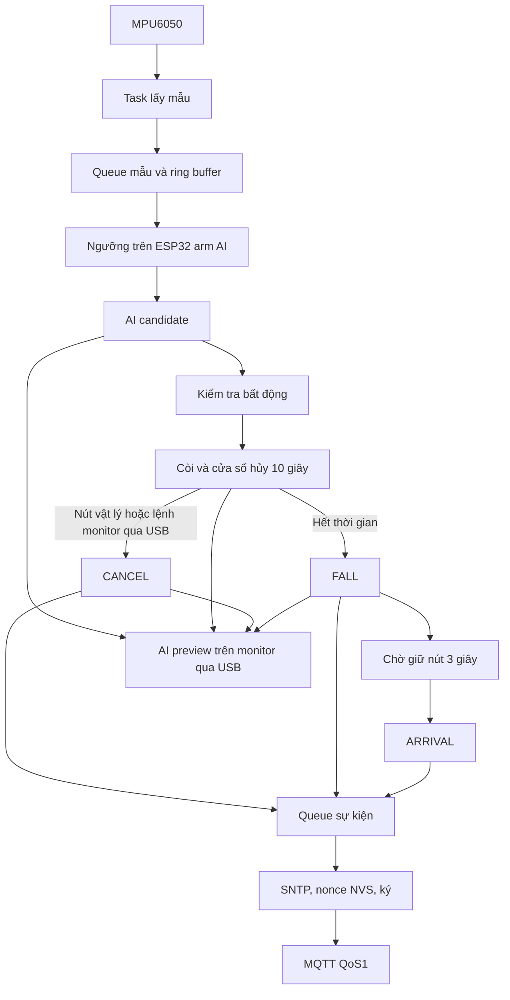

# Ôn phản biện — P3 (Firmware ESP32)

## 1. Tôi đã làm gì
Tôi phụ trách firmware cho ESP32 DevKit V1, MPU6050, buzzer và nút. Firmware lấy mẫu cảm biến, chạy model INT8 bằng TFLite Micro và dùng state machine để xử lý nghi té ngã. Ngưỡng gia tốc chỉ arm AI; AI candidate tiếp tục qua kiểm tra bất động và cửa sổ hủy 10 giây. FALL, ARRIVAL và CANCEL được ký bằng khóa thiết bị; nonce được lưu trong NVS trước khi gửi MQTT. Monitor có thể gửi lệnh hủy qua USB serial trong cửa sổ hủy, còn topic và payload MQTT giữ nguyên. Firmware mới đã build nhưng chưa được flash và kiểm tra end-to-end trên board; golden test AI vẫn chưa đạt.

## 2. Luồng xử lý phần của tôi


## 3. Các đoạn code quan trọng nhất
Trích logic `main.c`:
```c
uint64_t nonce = last_nonce + 1;
ESP_ERROR_CHECK(nvs_set_u64(nonce_store, "nonce", nonce));
ESP_ERROR_CHECK(nvs_commit(nonce_store));
last_nonce = nonce;
```
`commit` phải hoàn tất trước khi phát gói. Nếu mất điện sau commit nhưng chưa gửi, nonce có thể bị bỏ qua, vẫn hợp lệ vì chain yêu cầu tăng chứ không yêu cầu liên tiếp.

Trích `signer.c`:
```c
memcpy(packed, device, 20); packed[20] = type;
put_u64_be(packed + 21, timestamp);
put_u64_be(packed + 29, nonce);
memcpy(packed + 37, data_hash, 32);
signer_hash(packed, 69, message_hash);
```
Tổng đúng 69 byte, không chèn padding như struct C. Timestamp và nonce là big-endian; raw cảm biến là little-endian.

## 4. Quyết định thiết kế và lý do
- Tách lấy mẫu, CSV và ký/gửi: MQTT có thể chờ lâu nên không để nó làm trễ lấy mẫu.
- Ngưỡng MPU6050 chỉ kích hoạt suy luận; quyết định candidate đến từ model AI. Golden test board chưa đạt nên kết quả live chưa được xem là đã xác thực.
- Suy địa chỉ từ public key, không nhập hai giá trị có thể lệch nhau.
- Snapshot raw riêng cho sự kiện để ring buffer mới không ghi đè bytes đang ký.
- Không tự xóa NVS khi lỗi; làm vậy có thể dùng lại nonce. Lỗi NVS làm dừng để sửa có kiểm soát.
- QoS1 giúp retry khi mất Wi-Fi, nhưng không bảo đảm gateway/chain đã xử lý và có thể giao gói lặp.
- Nút monitor gửi lệnh qua serial và chờ MQTT CANCEL xác nhận; monitor không tự ẩn banner khi mới gửi lệnh.

## 5. Câu hỏi giảng viên có thể hỏi
1. **Vì sao ESP32 không gọi blockchain trực tiếp?** MQTT/gateway tách cảnh báo nhanh khỏi giao dịch chậm và quản lý RPC.
2. **Khóa ở đâu?** Được cấu hình cục bộ trong secrets.h rồi nằm trong firmware/flash. Người đọc được flash có thể lấy khóa; flash encryption/secure element là hướng cải thiện, chưa triển khai.
3. **Nonce làm gì?** Phân biệt lần phát và chống replay; NVS giúp bộ đếm không quay về 0 sau reset.
4. **Cửa sổ hủy có làm chậm cảnh báo không?** Có, thêm 10 giây trước khi phát FALL; đổi lại người đeo có thể hủy báo nhầm. Mục tiêu dưới 2 giây của luồng cảnh báo tính từ phát FALL, không bao gồm cửa sổ này.
5. **Giữ nút 3 giây chứng minh gì?** Có thao tác tại thiết bị, chưa chứng minh danh tính người nhấn hay chất lượng chăm sóc.
6. **Mất Wi-Fi thì sao?** Còi và state chạy cục bộ; giữ sự kiện trong RAM, retry khi nối lại. Queue hữu hạn và mất điện sẽ mất phần đang chờ.
7. **Heartbeat chống gian lận gì?** Giúp gateway nhận biết thiết bị mất liên lạc. Không chứng minh thiết bị đang đeo đúng hoặc cảm biến còn hoạt động chính xác.
8. **Có ACK MQTT là chain đã nhận chưa?** Chưa. Broker ACK chỉ là một bước; phải kiểm tra receipt ở gateway.
9. **Có được hủy sau FALL không?** Không. Sau FALL chỉ chờ xác nhận có mặt, đúng luật SLA của nhóm.
10. **AI đã chạy trên ESP32 chưa?** Model INT8/TFLite Micro đã tích hợp và firmware build được; golden trên board chưa đạt nên chưa thể xác nhận dự đoán đúng.
11. **Vì sao chỉ lưu hash lên chain?** Giữ dữ liệu thô off-chain; hash giúp đối chiếu bytes nhưng không chứng minh dữ liệu đo phản ánh sự thật.
12. **Khớp vector PC có đủ không? Nút monitor hủy ra sao?** Không; cần kiểm tra vector trên ESP32/contract và nonce sau reboot. Nút gửi `CANCEL_FALL\n` qua USB trong cửa sổ 10 giây; ESP32 xử lý như nhấn ngắn và phát event CANCEL hiện có. Cần test trên board thật.

## 6. Giới hạn và điều chưa chắc chắn
⚠️ `AI_RUN_GOLDEN_TESTS=0`; các golden INT8 trên board từng mismatch nên chưa xác nhận độ đúng model. Bản firmware mới có serial cancel và DEVICE_READY chưa được flash; nút GUI, ARRIVAL, reset, Wi-Fi/MQTT và state sau reboot chưa được kiểm thử end-to-end trên board. Chưa đo runtime heap/stack hay 20 lần độ trễ. App partition chỉ còn khoảng 3%. State và queue sự kiện chưa bền qua reset; nonce có lưu NVS. Chữ ký không chứa contract/chainId theo giới hạn chung.

## 7. Liên hệ với phần của người khác
- Nhận từ P4: model INT8 và đặc tả preprocessing; cần tiếp tục phối hợp giải quyết golden mismatch, thống nhất hướng đeo/trục. Đưa dữ liệu cảm biến và kết quả runtime để đối chiếu.
- Nhận từ P5: vector chuẩn, công cụ sinh khóa, broker/gateway. Đưa P5 event đã ký, raw cùng nonce và heartbeat theo interface chung.
- Cùng P1/P2 kiểm tra chữ ký và thứ tự sự kiện được contract chấp nhận.

## 8. Ba câu tự kiểm tra

### Bổ sung: lỗi padding INT8 phát hiện ngày 2026-09-27

- Số thực được khôi phục bằng `(q - zero_point) * scale`. Vì vậy số thực 0
  phải được padding bằng `zero_point`, không mặc định là byte 0.
- Model có tensor zero-point -128 và scale khoảng 0.02353. Padding byte 0
  tương ứng khoảng 3.01, làm sai dữ liệu đi vào các lớp sau.
- Kernel local SPACE_TO_BATCH_ND thiếu gán tham số padding; đã sửa và kiểm tra
  phép padding trên PC, build firmware đạt. Cần golden trên board để xác nhận
  sửa end-to-end. Build thành công không chứng minh inference đúng.
- Python AUTO khớp 10/10 golden, nhưng backend tham chiếu có thể lệch 1–2 mức
  INT8. Chưa tự nới tiêu chí kiểm tra trên board.

1. Mất điện ngay sau commit nonce nhưng trước publish có gây replay không? Vì sao?
2. Byte order của raw khác byte order của gói 69 byte ở đâu?
3. Nếu broker ACK nhưng Telegram không đến, cần kiểm tra ở tầng nào và vì sao?
